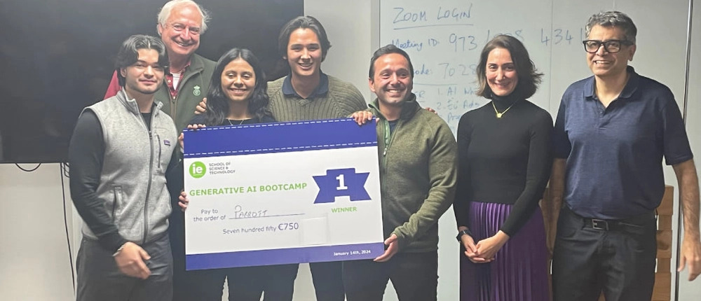

# Parrot: GenAI Hackathon 1st place winner

Parrot is a Chrome extension developed as part of the winning project for the GenAI venture bootcamp at IE University. The extension aims to provide a seamless solution for language learning by scanning the user's webview, selecting optimal words for learning in Spanish, and presenting them to the user in a quiz format. This functionality helps users learn new words in Spanish effortlessly as they browse the web.

<p align="center">
  
</p>

[School article about the project](https://www.ie.edu/school-science-technology/news/sci-tech-students-develop-startup-ideas-in-generative-ai-bootcamp/)

[Pitch deck](docs/Parrot%20-%20Pitch.pdf)

## Overview

Parrot is designed to enhance the language learning experience by integrating it into the user's daily web browsing activities. By leveraging AI and real-time text analysis, Parrot identifies suitable words from the content being viewed and quizzes the user on their translations to Spanish. This innovative approach helps users learn new vocabulary contextually and engagingly.

## Features

- **Real-time Text Analysis:** Scans the webpage content to extract visible text and selects words for learning.
- **Interactive Quizzes:** Presents quizzes with multiple choice options to help users learn the translations.
- **Customizable Settings:** Allows users to enable or disable the extension and configure various settings.

## Technology Stack

- **Chrome Extension:** Developed using HTML, CSS, and JavaScript.
- **Backend Server:** Flask framework in Python.
- **AI Integration:** Utilizes OpenAI's GPT-4 for text processing and quiz generation.

## System Design

The system architecture consists of the following components:

1. **Content Script (content.js):** Scans the webpage content and sends the text to the backend server.
2. **Backend Server (server/app.py):** Processes the text using AI to select a word and generate quiz options.
3. **Popup Interface (popup.html, popup.js):** Provides the user interface for enabling/disabling the extension and configuring settings.
4. **Background Script (background.js):** Manages the state of the extension.

## Setup and Installation

### Prerequisites

- Google Chrome
- Node.js and npm
- Python 3.8 or higher
- Flask

### Installation Steps

1. **Clone the Repository:**
   ```bash
   git clone https://github.com/gabrieldeolaguibel/GenAI-Hackathon.git
   cd GenAI-Hackathon
   ```

2. **Install Dependencies:**
   ```bash
   pip install -r requirements.txt
   ```

3. **Configure API Keys:**
   - Obtain API keys from OpenAI.
   - Create `secrets` directory in the root of the project.
   - Add `api_key.txt` and `api_org.txt` with your OpenAI API key and organization respectively.

4. **Run the Backend Server:**
   ```bash
   cd server
   python app.py
   ```

5. **Load the Extension in Chrome:**
   - Open Chrome and navigate to `chrome://extensions/`.
   - Enable Developer mode.
   - Click "Load unpacked" and select the `extension` directory from the cloned repository.


## Usage

1. **Enable the Extension:**
   - Open the extension popup and enable it using the toggle switch.

2. **Start Browsing:**
   - The extension will automatically scan the webpages you visit and select words for learning.
   
3. **Take Quizzes:**
   - Quizzes will pop up periodically with words selected from the webpage content. Answer the quizzes to reinforce your learning.